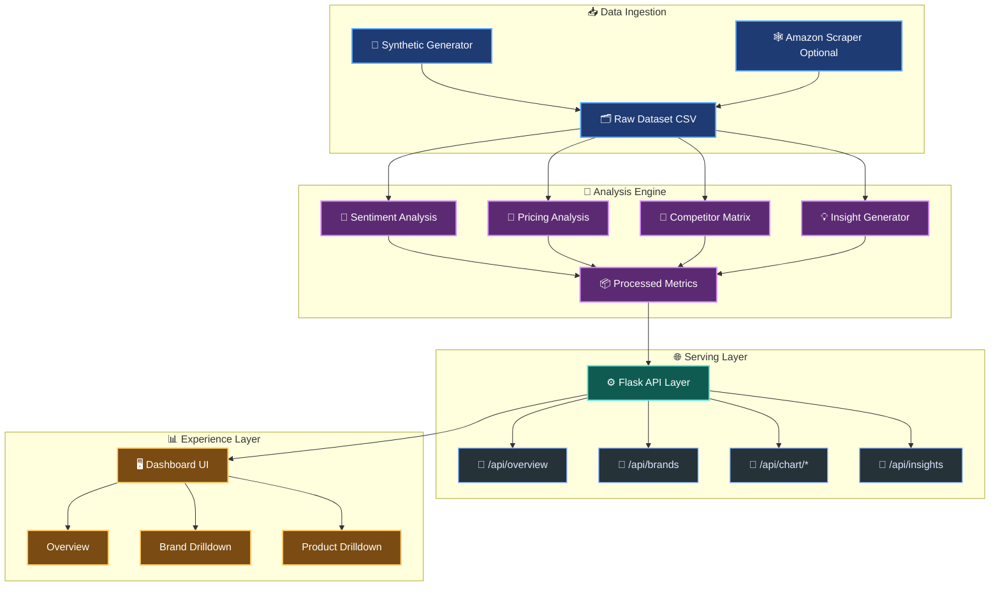

# LuggageIQ - Competitive Intelligence Dashboard 🧳📊

An end-to-end data intelligence project for Amazon India luggage brands.

This project covers:
- synthetic data generation (fallback when scraping is blocked)
- sentiment and aspect analysis
- pricing and value scoring
- competitor benchmarking
- insight generation
- interactive Flask + Plotly dashboard

---

## Demo Links 🔗

- Live demo: https://luggageiq.vercel.app/ 
- Video Url: https://drive.google.com/file/d/18i3tP4_jjhS4viy5LVNi5np3nog1rTBe/view?usp=sharing 

---

## Key Features ✨

- Multi-brand comparison across price, rating, sentiment, and value
- Aspect-level quality analysis (wheels, handle, material, zipper, size, durability)
- Auto-generated strategic insights for decision-making
- Brand and product drilldown pages
- API-backed interactive visualizations

---

## Project Architecture 🏗️



---

## Folder Structure 📁

```text
.
|-- main.py
|-- generate_dataset.py
|-- requirements.txt
|-- analysis/
|   |-- sentiment.py
|   |-- pricing_analysis.py
|   |-- competitor_analysis.py
|-- agent/
|   |-- insight_generator.py
|-- scraper/
|   |-- amazon_scraper.py
|   |-- review_scraper.py
|-- dashboard/
|   |-- app.py
|   |-- static/
|   |-- templates/
|-- data/
|   |-- raw/
|   |-- processed/
|-- utils/
|   |-- helpers.py
|   |-- data_cleaning.py
```

---

## End-to-End Pipeline (Short) 🔄

1. 🧱 Data is generated or scraped into raw CSV.
2. 🧠 Sentiment and aspect signals are computed.
3. 💸 Pricing, discount, and value metrics are derived.
4. 🏁 Brand comparison matrix and scorecards are built.
5. 💡 Insight engine generates decision-ready summaries.
6. 🌐 Flask serves chart APIs and HTML pages.
7. 📈 Dashboard renders interactive views for analysis.

---

## Core Formulas Used 🧮

### 1) Sentiment Label Mapping

- positive if sentiment_score >= 0.65
- neutral if 0.40 <= sentiment_score < 0.65
- negative if sentiment_score < 0.40

### 2) Price Normalization

$$
price\_norm = \frac{avg\_price - min\_price}{max\_price - min\_price + 1}
$$

### 3) Soft Price Component

$$
soft\_price\_component = \frac{1}{0.7 + \sqrt{price\_norm}}
$$

Then scaled to $[0,1]$ as price_score.

### 4) Weighted Value Score

$$
value\_score = 0.35(sentiment) + 0.25(rating) + 0.20(durability) + 0.20(price\_score)
$$

### 5) Percentile Value Score (0-100)

$$
value\_score\_pct = percentile\_rank(value\_score) \times 100
$$

### 6) Radar Score Normalization

For most axes:

$$
norm = \frac{x - x_{min}}{x_{max} - x_{min}} \times 100
$$

For affordability (inverse price):

$$
affordability = 100 - norm(avg\_price)
$$

---

## Local Setup and Run 💻

### Prerequisites ✅

- Python 3.10+
- pip
- optional: Playwright + Chromium for scraping

### 1) Clone and enter project 📦

```bash
git clone <your-repo-url>
cd Munshot
```

### 2) Create and activate virtual environment 🐍

Windows PowerShell:

```powershell
python -m venv .venv
& ".venv\Scripts\Activate.ps1"
```

### 3) Install dependencies 📥

```powershell
pip install -r requirements.txt
```

### 4) Generate dataset 🧪

```powershell
python main.py --generate
```

### 5) Run analysis pipeline in terminal 🔍

```powershell
python main.py --analyze
```

### 6) Start dashboard on localhost 🚀

```powershell
python main.py
```

Open:

- http://127.0.0.1:5000

---

## Optional Scraping Mode 🕸️

Install scraping dependencies:

```powershell
pip install playwright
python -m playwright install chromium
```

Run scraper:

```powershell
python main.py --scrape
```

If scraping is blocked by Amazon, the project falls back to synthetic data.

---

## API Endpoints 🧭

- GET /api/overview
- GET /api/brands
- GET /api/brand/<brand_name>
- GET /api/insights
- GET /api/chart/price_rating
- GET /api/chart/brand_price
- GET /api/chart/discount
- GET /api/chart/sentiment
- GET /api/chart/review_count
- GET /api/chart/aspect_sentiment
- GET /api/chart/price_box
- GET /api/chart/value_score
- GET /api/chart/radar/<brand_name>
- GET /api/filter

---

## Deployment Notes ☁️

- You can deploy on Render, Railway, Fly.io, or any VPS.
- For production, use gunicorn instead of Flask development server.

Example startup command:

```bash
gunicorn dashboard.app:app --bind 0.0.0.0:5000 --workers 2
```

---

## Troubleshooting 🛠️

### Charts not rendering

- Hard refresh browser (Ctrl+F5)
- restart server
- verify /api/chart/* endpoints in browser

### Notebook plot errors (nbformat/statsmodels)

```powershell
pip install --upgrade nbformat ipykernel statsmodels
```

### Port already in use

- stop existing process or change port in main.py

---

## Assignment Highlights 🎯

- Problem: compare market brands with review-driven intelligence
- Approach: analysis pipeline + scoring + visual storytelling
- Output: decision-ready dashboard with explainable metrics

---

## Tech Stack 🧰

- Python
- Flask
- Pandas, NumPy
- Plotly
- VaderSentiment
- Playwright (optional)

---

## Author 👤

- Name: Ashmeet Singh Sandhu
- Role: Moonshot AI Agent Intern Assignment Submission

---

## Quick Demo Script 🎬

Use this sequence during your demo:

1. ▶️ Run dataset generation command
2. ▶️ Run analysis command and show terminal summary
3. ▶️ Launch dashboard
4. ▶️ Show overview, brand drilldown, product drilldown
5. ▶️ Show API endpoints in browser
6. ▶️ Share deployed link

Looking Forward to Contribute More ! 🚀
